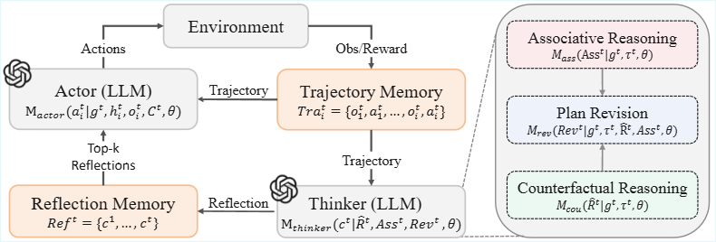

<!-- <h1 align="center"> Causal Inference Augmented Reflection for Long-Term Planning via LLMs </h1> -->

<!--

  ICRA 2025

-->

<!--
[author1](https://www.yuque.com/zhangjiatao-grdyv/rn49ht/lz080qshd6weqi0g)
-->

## Abstract
Recent developments suggest that Large Language Models (LLMs) can identify and correct errors in their generated responses using reflection mechanisms. However, when applied to long-horizon task planning, these methods reveal significant limitations. Reflection methods may neglect the causes of errors in earlier planning, producing results that contain inaccurate information, thereby leading to further mistakes in subsequent planning. This paper explores the reflection framework suitable for long-horizon task planning. Inspired by human causal cognitive processes, we introduce the Causal Reasoning augmented reFlecTion framework (CRaFT). CRaFT employs systematic causal reasoning to accurately identify the root causes of errors and to generate effective action plan revisions by integrating association information. We conducted household task experiments in ALFWorld and VirtualHome, and the results show that CRaFT significantly improves success rates by 34\% and 27\%, respectively, on complex long-horizon tasks. Furthermore, we applied CRaFT to a real-world robotic system, highlighting its potential for practical applications. Website at https://causalraft.github.io/

## Paper
<iframe  width="400" height="420" src="./Causal_Reasoning_Augmented_Reflection_for_Long-Horizon_Robotic_Planning.pdf"></iframe>

## Video
<iframe width="560" height="315" src="https://www.youtube.com/embed/bDYz9beUUgc?si=BDGy72KEdKV0TjOy" title="YouTube video player" frameborder="0" allow="accelerometer; autoplay; clipboard-write; encrypted-media; gyroscope; picture-in-picture; web-share" referrerpolicy="strict-origin-when-cross-origin" allowfullscreen></iframe>

## Results
Example of our frameworks for long-term task planning:

  

## Methodology
Our framework operates by taking historical task information and environmental feedback as input and producing reflection results as output. The framework comprises three stages: 
1) Associative Reasoning is tasked with inferring about the associations.
2) Plan Revision is charged with generating the action plan revisions for subsequent trials. 
3) Counterfactual Reasoning is responsible for identifying and repairing error actions and analyzing the RCE.
4) Additionally, we have introduced a Memory Management module to manage the historical results generated.

  

 

  

## Experiment

    

          <video width="380" height="240" controls autoplay>
            <source src="./fail1.mp4"
                    type="video/mp4">
          </video>
    

    

          <video width="380" height="240" controls autoplay>
            <source src="./succ1.mp4"
                    type="video/mp4">
          </video>
    

  <pre style="text-align: center;  background-color: white; border: none;">             A.Initial Trial                                 B.Improved Trial </pre>

## Appendix
### A.Method
#### 1.Prompt for Counterfactual Reasoning

Listing 1: Prompt for Counterfactual Reasoning, we need to input the example from the previous attempt and the failed plan.

    

    <pre>
You will be given the history of a past experience in which you were placed in an environment and given a task to complete. you were unsuccessful in completing the task. You will also be given a list of key actions that can be used to complete the task. Then, review the past experience and identify the key actions that led to task failure or execution failure based on the descriptions in the list of actions, and use counterfactual reasoning to modify or add the correct actions based on the grammatical requirements in the list of actions to get to the root of the problem. Finally, find the root cause of task failure based on the grammatical requirements in the action list. Note: Do not seek the causes of failure from task goal definition or actions in the action list. Ensure tasks can be completed within the range of actions listed. A specific action fails because its prerequisites mentioned in the action list were not met. Do not have more than three counterfactual reasoning analysis. 

=================Action List=====================
When you do not take the object or not go to the container but want to use the following actions, you will fail.
1.heat {obj} with microwave: Heat the specified object (obj) with the microwave.
2.clean {obj} with sinkbasin: Cleans the specified object (obj) with the sinkbasin.
3.cool {obj} with fridge : Cool the specified object (obj) with the fridge.

When you do not see the object or go to the container but want to use the following actions, you will fail.
4.take {obj} from {recep}: Take the specified object (obj) from the specified container (recep).
5.put {obj} in/on {recep}: Put the specified object (obj) into the specified container (recep).

When the target container is not present but you want to use the following actions, you will fail.
6.go to {recep}: Use it when you want to go to the specified container (recep).

When you do not see the container but want to use the following actions, you will fail.
7.open {recep}: Use it when you want to see the items inside the container."""

I will give you the example to help you better understand how to use counterfactual reasoning to generate counterfactual reasoning analysis.

=================The example=====================
Counterfactual reasoning analysis:
1. If I add the action "***" before the action "***", then I don't get this failure. The first root cause of the task failure was due to ***.
2. If I add the action "***" after the action "***", then I don't get this failure. The second root cause of the task failure was due to ***.
3. If I correct the action "***" to the action "***", then I don't get this failure. The third root cause of the task failure was due to ***.

Here is the history you need for counterfactual reasoning:
Interact with a household to solve a task. Here is an examples.
{react_example_input}

Here is the task: {task}

Counterfactual reasoning analysis:
  </pre>
  

#### 2.Prompt for Associative Reasoning

Listing 2: Prompt for Associative Reasoning, we need to input the failed plan from the previous attempt.

    

    <pre>

You will be given the history of a past experience in which you were placed in an environment. First, identify the names of the items included in the task goal, excluding information about states such as 'clean', 'heat', 'cool', etc. Then, based on the identified item name, review the results of your sighting and determine in which container the item that matches the item name was placed prior to the move, i.e., where you saw the item. When no items related to the task goal are found, provide the containers that have been explored , i.e. in which container the search failed. You do not need to focus on the environmental observations in the examples. Your output only needs to contain what you saw.

Here are two examples:
=================The first example=====================
{example1}

=================The second example=====================
{example2}

Here is the history of the past experience:
{past_experience}

Associative reasoning analysis:
  </pre>
  

#### 3.Prompt of Plan Revision

Listing 3: Prompt for Plan Revision, we need to input the above two analyses and task information.

    

    <pre>

You will be given the history of a past experience in which you were placed in an environment and given a task to complete. You were unsuccessful in completing the task.You will be provided with an analysis of counterfactual reasoning and association reasoning based on your previous experience. Please create a plan for the next attempt, incorporating insights from these two analyses. You need to output in the format of the example without any additional redundant content.
I will give you some examples to help you better understand how to generate plan.

=================The first example=====================
{example1}

Here is the history you need for generating plan:
{past_experience}

{counterfactual_reasoning}

{association_reasoning}

Plan:
  </pre>
  

### B.Experiments
#### 1.Implement of Reflexion

We have adopted the reflexion method from Reflexion, which integrates a reflection process during multiple trials in React, obtaining the next action based on the reflection from the previous trial.

Listing 5:The prompt with LLM of react-reflexion agent to implement task planning

    

    <pre>
You will be given the history of a past experience in which you were placed in an environment and given a task to complete. You were unsuccessful in completing the task. Do not summarize your environment, but rather think about the strategy and path you took to attempt to complete the task. Devise a concise, new plan of action that accounts for your mistake with reference to specific actions that you should have taken. For example, if you tried A and B but forgot C, then devise a plan to achieve C with environment-specific actions. You will need this later when you are solving the same task. Give your plan after "Plan". Here are two examples:

{FEW_SHOT_EXAMPLES}

{past_experience}

Plans from past attempts:
Trial #{i}: {Plan_i}

New plan:
    </pre>
  

